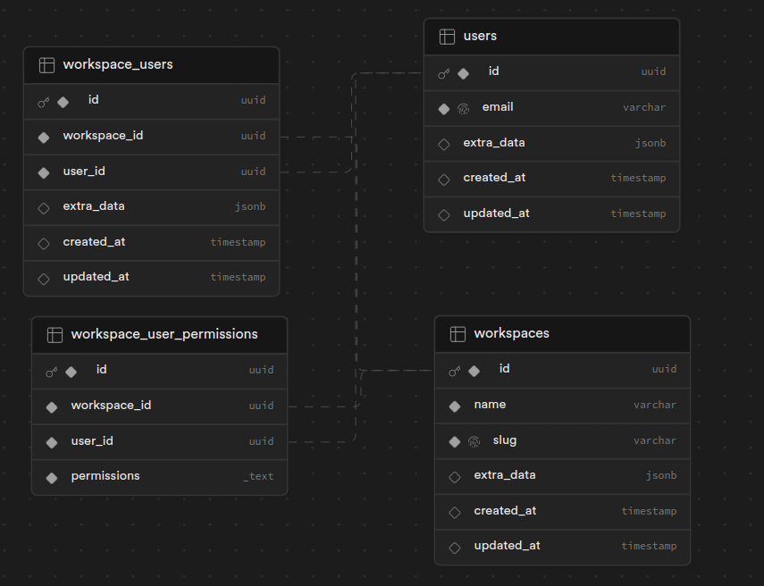

# Multi-Tenant Scalable Architecture with Supabase

This project implements a scalable multi-tenant architecture using Supabase and PostgreSQL's Row Level Security (RLS) features. It provides a robust foundation for building secure, isolated, and scalable applications with multiple workspaces.

## Features

- **Multiple Tenants (Workspaces)**: Support for multiple tenants with data isolation.
- **Row Level Security (RLS)**: Comprehensive setup with scalable policies for access control.
- **Tenant Data Isolation**: Ensures data separation between different tenants.
- **Tenant Resource Usage Tracking**: Table to monitor resource usage per tenant.
- **Supabase Auth Integration**: Hook for adding user tenant permissions.

## Database Schema



## Getting Started

### Prerequisites

- Supabase account
- Supabase CLI or `npx`
- Git

### Setup

1. Create a new Supabase project at [database.new](https://database.new).

2. Set up your local environment:
   ```bash
   mkdir project-name
   cd project-name
   git init
   ```

3. Install Supabase CLI or use `npx`.

4. Run setup commands:
   ```bash
   supabase login
   supabase link --project-ref <project_id>
   supabase db reset --linked
   ```

### User Setup

Ensure each user has a `workspace_id` in the `app_metadata` JSONB. Update this from your application using supabase admin instance when creating a user:

```javascript
const supabaseServiceRoleInstance = createClient(SUPABASE_API_URL, SERVICE_ROLE_KEY, {
  db: {
    schema: "base"
  }
}) 
await supabaseServiceRoleInstance.auth.admin.updateUserById(userId, {
  app_metadata: {
    org_id: orgId
  },
});
```

## Adding New Tables

When creating new tables, follow this [guide](docs/new-table.md) for implementing appropriate RLS policies to maintain data isolation and access control.

## Roadmap

- Support for users belonging to multiple tenants
- Implementation of unit tests
- Functionality to seed sample data

## Contributing

Contributions are welcome! Please refer to our contributing guidelines for more information.

---

For more detailed information on RLS policies, functions, and specific implementation details, please refer to the project documentation.
